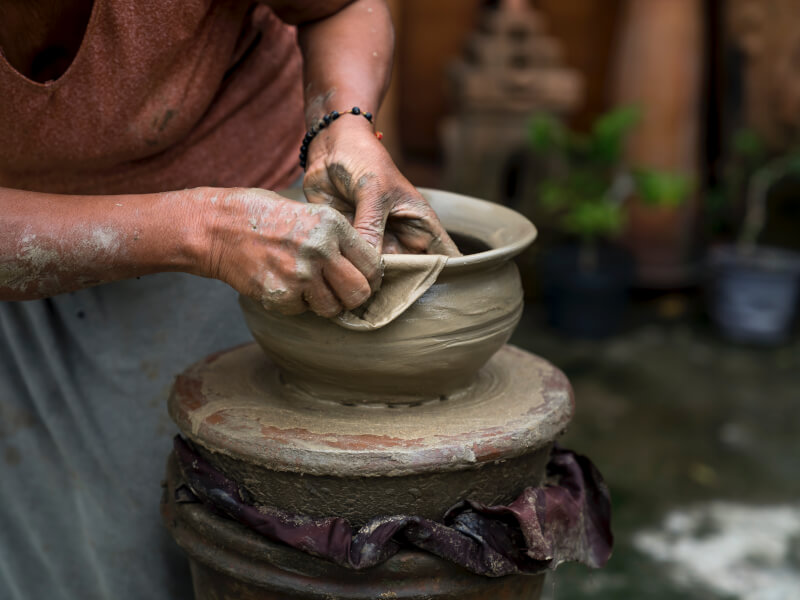

<!DOCTYPE html>
<html lang="en">
<head>
    <meta charset="UTF-8">
    <meta name="viewport" content="width=device-width, initial-scale=1.0">
    <title>Be My Valentine</title>
    
</head>
<body>
    
<b>Will you be my valentine?</b>

    <button class="answerButton" onclick="location.href='thankyou.html'">Yes</button>
    <button class="answerButton" id="noButton">No</button>
    <button class="answerButton" id="noButton">I no no wanna o(╥﹏╥)o</button>
     
    

	
</body>
</html>

<!DOCTYPE html>
<html lang="en">
<head>
	<meta charset="UTF-8">
	<meta name="viewport" content="width=device-width, initial-scale=1.0">
	<title>Document</title>
	
</head>
<body>
	
<u><b>What are we doing after?</b></u>
	
<b>What are we doing after?</b>
	

	

		

			
			<label><input type="checkbox" name="activities" value ="aquarium">aquarium</label>
		

			
			<label><input type="checkbox" name="activities" value ="arcade">arcade</label>
		

		

			
			<label><input type="checkbox" name="activities" value ="cinema">cinema</label>
		

		

			
   <label><input type="checkbox" name="activities" value ="ceramics">ceramics</label>
		

		

			
			<label><input type="checkbox" name="activities" value ="kunsthalle">exhibition</label>
		

		

			
			<label><input type="checkbox" name="activities" value ="park.jpeg">park</label>
		

	

	<button onclick="location.href='lastpage.html'">Last page</button>
 </body>
</html>
